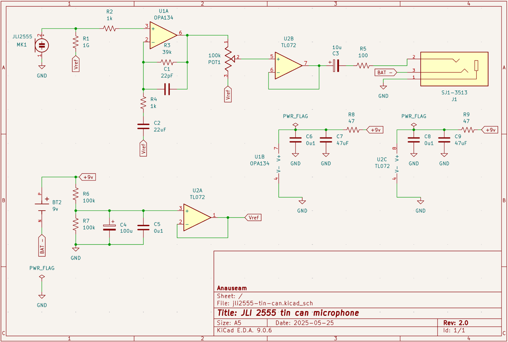

# JLI-2555-tin-can-mic

A unprofessional "Mid"-Fi mic using a JLI 2555, meant to be housed in a tin can.

## Specs

Output voltage is designed to output a commercial level line signal via a TS connection.

All the components were designed to be purely through hole and non-obsolete, thus limiting the choices drastically.

If you would like a circuit that you can order pre made refer to the [WIP] Repo.

## Notes / Known issues

Because the potentiometer is DC biased, when the potentiometer collects dust years down the road there will be a scratching nose when turning the knob. Given that this is a literal mic housed in a tin can, I can accept this fact

Yes the entire circuit is running off of a 9v. This makes things as simple as possible, perfect for a proof of concept tin can microphone. Reasons for the unipolar supply:

- Adding a bipolar supply (two batteries) would introduce a new array of issues (e.g. uneven battery drain, size)

The biggest issue (IMO) is the OPA134 itself. Although it does have an excellent noise floor compared to standard op amps, compared a something like the OPA1642, or a proper discrete JFET, it has a noise floor of about 12.45 nV/sqrt(Hz) when considering the op amp's voltage noise and the voltage noise from the affect of the op amp's current noise and 1G resistor.

## TODO

Current the PCB is haphazardly connected, a proper layout will be completed once testing of the original circuit is done.

I will probably create a proper pcb with SMT
